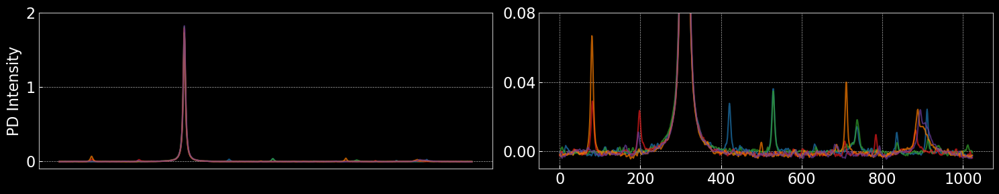

## Automating Experimental Optics with Sample Efficient Machine Learning Methods

**Paper Link:** [arXiv:2503.14260](https://arxiv.org/abs/2503.14260)  
**For more information:** [GitHub Repository](https://github.com/arindam5aha/aqua)

### Abstract
As free-space optical systems grow in scale and complexity, troubleshooting becomes increasingly time-consuming and, in the case of remote installations, perhaps impractical. An example of a task that is often laborious is the alignment of a high-finesse optical resonator, which is highly sensitive to the mode of the input beam. In this work, we demonstrate how machine learning can be used to achieve autonomous mode-matching of a free-space optical resonator with minimal supervision. Our approach leverages sample-efficient algorithms to reduce data requirements while maintaining a simple architecture for easy deployment. The reinforcement learning scheme that we have developed shows that automation is feasible even in systems prone to drift in experimental parameters, as may well be the case in real-world applications.


### Visualising the Observation Space

### Visualising Different Hermite-Gauss Modes
These outputs are simulated.


### Calculating Finesse from Full FSR Trace

Analysing both transmission and reflection traces:

<!-- - Top two peak positions: [1.41426484, 1.42037134]
- FWHM of the top two peaks: [4.375, 3.50930248]
- Difference between top two peak positions: 504
- Ratio of difference to FWHM: [115.2, 143.618284] -->

Finesses used for paper: 129.40914200074948

### Control Specs

Bounds for the optimization and control:  
The values represent the thread counts moved by the actuators.  
For more info visit: [Thorlabs](https://www.thorlabs.com/navigation.cfm?guide_id=83)

- Lens_1: (-100000, 100000)
- Lens_2: (-100000, 100000)
- Mirror_1x: (-5000, 5000)
- Mirror_1y: (-5000, 5000)
- Mirror_2x: (-5000, 5000)
- Mirror_2y: (-5000, 5000)

### Reward Function Used in Experiment: $\eta$

This is the sole reward function used in the experiment for both SANN and AQUA.

```python
def noisy_eta(obs, target_region=(400, 550)):
    #input: obs - the observed cavity trace (array of length 1024)
    #target_region - the region of interest, including the target mode
    
    target_integral = np.trapz(obs[target_region[0]:target_region[1]])
    complete_integral = np.trapz(obs)
    eta = target_integral / complete_integral
    return eta
```

### Corrected Reward Function: $\eta'$

Used to post-process all collected data and use for comparison.

```python
def corrected_eta(obs, distance=5, prominence=5e-3, target_region=(400, 550)):
    # input: distance, prominence are parameters for the SciPy peak finding algorithm
    # these are to be kept constant for all data, unless additional corrections are needed.
    
    # Correct for the detector offset
    obs = obs - np.median(obs)
    
    # Find the peaks    
    peaks, _ = find_peaks(obs, distance=distance, prominence=prominence)    

    # Calculating the reward
    target_pk_height = max(obs[target_region[0]: target_region[1]])
    sum_pk_height = np.sum(obs[peaks])
    eta_prime = target_pk_height / sum_pk_height
    return eta_prime
```

## Results and Discussion

### Manual Alignment


- MAX HUMAN MME: 0.956
- MEAN HUMAN MME: 0.932
- Std. Dev: 1.68 %

<!-- ### SANN Optimisation on Experiment


Visualising best SANN results.

 -->

### Analyse AQUA Performance on Experiment

Loading run with resets.

Loading No Reset Run.


- Avg time per step: 5.435340497249661


- MAX HUMAN MME: 95.66 %
- MEAN HUMAN MME: 93.19 %

### Supplementary Information

### Linear Relation Between $\eta$ and $\eta'$

Each colored scatter plot represents an individual SANN run. The runs occurred on different days and as can be seen from the plot below, each run gives a slightly different slope suggesting change in conditions. Deviations seen are caused by noise. The detector offset causes the x-axis to have an offset, meaning $\eta$ does not reach 0.

- Slope: 1.78561321556722
- Intercept: -0.11827958713759489


### Thermal Drift

Fluctuations in target peak heights and its position.

- Best Cost Height: 1.7208110246574506
- Best Cost: 0.6379340335853348
- Transmittance: 1.7256962227402255


### Actuator Drifts


### Scatter Plots of the Parameter Space


### AQUA: Model Specs

- Observation size: 1024, raw data as shown above without offset corrections is used (continuous)
- Action size: 6, uses the full bounds as mentioned previously (continuous)

Models config:
- Compatible with PyTorch version: 2.1.2
- CUDA version: 12.1
- [PyTorch](https://pytorch.org/)

- hidden_size: {'encoder': 64, 'prediction': 64, 'policy': 512}
- num_hidden_layers: 2
- latent_size: 32
- activation: leakyRelu
- input_sizes: {'encoder': '1024 + (6)', 'prediction': '1024 + (6)', 'policy': '32 + (6)'} // (6) for scaled parameters optional or used with dropouts
- optimiser: Adam
- lr: 0.0001
- batch_size: {'encoder': 50, 'prediction': 50, 'policy': 200}
- clip_grad_norm: 1.0
- dropout: 0.2
- weights_initializer: kaiming_uniform

Total no. of trainable parameters in the models: 558416  
(The latest version has 10x less parameters and much improved generalisation and training times)

### AQUA: Pre-training

### AQUA: Reset Conditions

All resets shown in the paper apply a parameter chosen randomly from the entire given bounds.  
As seen in AQUA's online learning plot, these mostly return $\eta'=0$. Below we visualise the associated observations and the parameters.


### AQUA: Realign Without Retraining


### AQUA: Visualising Top 5% Rewarded Observations


### Cross Entropy Method (CEM) Sampling on Experiment

CEM is a pseudo-random importance sampling method.  
[DOI: 10.1023/A:1010091220143](https://doi.org/10.1023/A:1010091220143)


As can be seen here, the reward landscape is different, given different configurations of the optics.


### Compare AQUA with Standard Model-Free RL (Stable Baselines) in Cavity Simulation

It is to be noted that the simulations are free of all kinds of drifts and one can expect to get similar rewards for repeat measurements.  
Thanks to Viktoria-S. Schmiesing for help with setting up SB3 and its reward function and Aaron Tranter for the simulation.  
For more information on the simulation environment visit: [GW Optics](https://www.gwoptics.org/pykat/)  
[Stable Baselines](https://stable-baselines.readthedocs.io/en/master/)  
[OpenAI Gym](https://www.gymlibrary.dev/)


Reward Functions used in simulation, with additional penalties to account for the multi-step architecture of standard model-free RL.

```python
# THE BASE REWARD FUNCTION FOR AQUA THAT CALCULATES COST FROM A TRACE

def reward(self, obs):        
    pv, _ = find_peaks(self.best_obs.squeeze(), height=0)
    pm = 15
    p1 = np.trapz(obs[pv[0]-pm:pv[0]+pm].squeeze())
    not_p1 = np.trapz(np.concatenate([obs[:pv[0]-pm], obs[pv[0]+pm:]]).squeeze()) * 0.3
    obs_reward = ((p1 - not_p1) + 4.0)/10.0 
    
    # The constants are chosen such that the best reward is less than 1 (by choice, not a necessity)
    return obs_reward
    
# THE REWARD FUNCTION FOR SB THAT USES THE AQUA REWARD 
# WITH ADDITIONAL PENALTIES STEPS TAKEN AND BOUNDS CROSSED

nc = reward(trace)

def base_rwd(self, nc): 
    # a static reward function   
    t = self.accuracy * self.max_neg_cost
    if nc >= t:
        rwd = 1.5*(np.exp(10*(nc-t))-1.0)
    else:
        rwd = (1.0-1.0/nc) + t
    return rwd

def calculate_reward(self, neg_cost):
    reward = 0
    bounds_crossed = False

    for i, p in enumerate(self.current_params):
        if p >= self.u_bounds[i] or p <= self.l_bounds[i]:
            bounds_crossed = True
    if bounds_crossed:
        reward -= 1

    if self.steps > self.max_steps:
        self.truncated = True

    reward += self.base_rwd(neg_cost)

    if neg_cost >= self.dynamic_accuracy * self.max_neg_cost:
        reward += 10*neg_cost
        self.success += 1
        self.dynamic_accuracy += 0.01
        if self.dynamic_accuracy >= 1.0:
            self.dynamic_accuracy = 1.0
        self.terminated = True

    if self.rwd_type == 'push':
        pass

    return reward

    # NOTE: IN BOTH CASES (AQUA & SB) THE OBSERVATION GIVEN IS SAME (TRACE + PARAMS)
    #       AND THE BOUNDS USED ARE ALSO SAME
```
